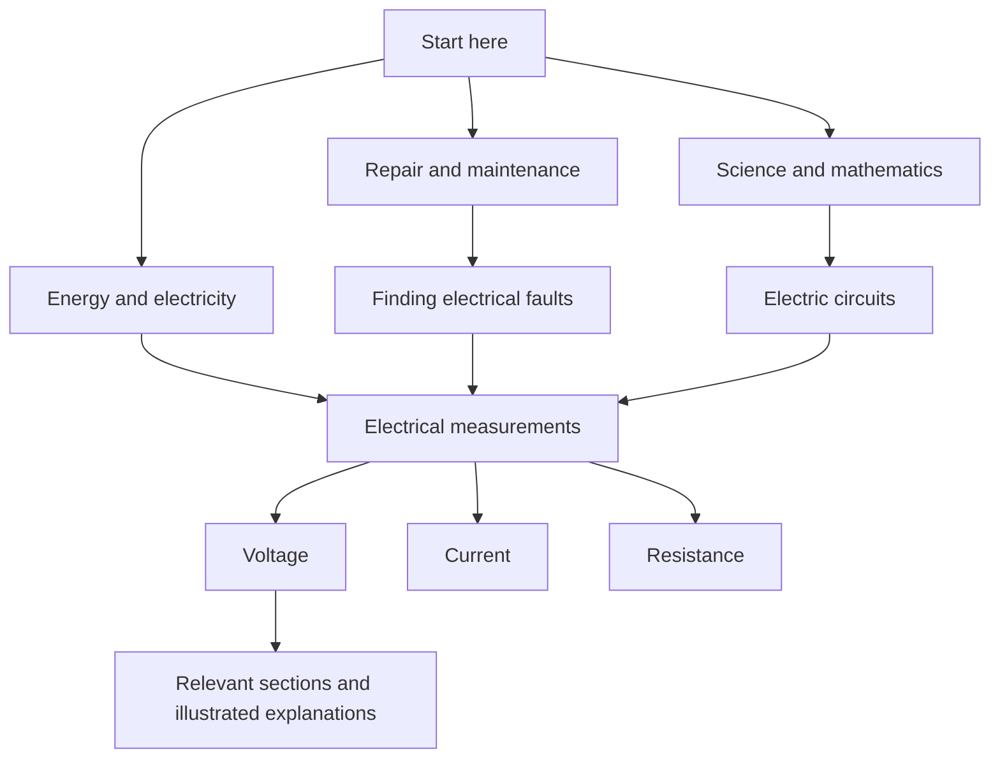

# OWL topic atlas: static hierarchical navigation

**Status:** Proposed specification; implementation remains deferred. The target
collections are now enumerated in [content selection](content-selection.md) and
`catalog/resources.yaml`. Exact collection members and source locations still
need curation and verification before atlas implementation.

**Implementation:** Not started. This document authorizes no implementation,
catalog changes, downloads, content conversion, or changes to existing profiles.
Topic names, resource examples, and numerical design targets below are provisional.
The current collection is useful evidence for feasibility, not the final include
list or a commitment to retain particular titles.

## 1. Intended outcome

A person who cannot use search should be able to start at a broad subject or
practical need, choose increasingly specific topics, and open the relevant part
of a document. The navigation must work from ordinary static HTML, without
JavaScript, a server, network access, accounts, or installed OWL software.

The atlas supports as much topic depth as the included material warrants. Common
finding tasks should reach useful source material within roughly three to five
link selections from the landing page. This is a usability target to test, not
a promise that every possible topic has content or fits a fixed depth.

Textbooks and illustrated guides remain first-class routes through the library.
Their relevant sections also appear under practical and academic topics. A book's
physical location under `BOOKS/` must not restrict how it can be discovered.

Multiple routes may lead to one topic and one source location. Duplicate useful
links, not source files or independently maintained copies of topic pages.

## 2. Scope and implementation gate

The proposed first release covers:

- A curated hierarchy of topics with multiple broader topics where appropriate.
- Task-oriented entrances alongside subject and learning entrances.
- Static topic pages, a topic-and-alias A–Z index, and book contents pages.
- Verified links into selected source sections, including illustrated material.
- Navigation generated for the actual assets in each completed drive.
- Automated structural validation and human finding-task evaluation.

The first release does not promise automatic classification of every Wikipedia
article, a universal knowledge taxonomy, OCR, generated emergency instructions,
full-text search changes, or new software for opening specialized archives.
Aliases in this specification are browsing labels, not search-query expansion.

Before implementation, finalize the include list and approve the resulting
initial navigation scope. At minimum, resolve:

| Decision | Needed information |
| --- | --- |
| Included sources | Asset IDs, editions/snapshots, source availability and rights |
| Profile coverage | Which sources are included and required in each profile |
| User priorities | Representative practical tasks and learning goals |
| Initial organization | Broad entrances, topic terminology, and languages |
| Section coverage | Sources needing chapter, section, figure, or article locators |
| Reader boundaries | Which topics have ordinary readable sources versus archive-only sources |
| Editorial review | Who approves topic mappings and high-priority source locations |

Implementation begins only after that review and a subsequent instruction to
build it. This specification creates no new coverage floors or content promises.

## 3. Navigation model

### 3.1 A hierarchy with shared topics

Topics are independent of filesystem folders and document categories. Each topic
has one stable ID and one canonical generated page. A topic may have several
parents. Hierarchical edges must form a directed acyclic graph: following narrower
topics must never bring the user back to an ancestor.

Related-topic links are separate from hierarchical edges. They may be reciprocal
or cyclic because they represent lateral movement, not increasing specificity.

Illustrative routes, subject to the final include list:



Generated SSD pages do not require Mermaid or any diagram-rendering library.

### 3.2 Entrances

The landing page should expose three complementary approaches:

- **Browse subjects:** familiar broad areas, with examples of what they contain.
- **Find practical guidance:** selected tasks described in ordinary language.
- **Learn:** foundations, textbooks, and illustrated guides.

All three approaches link into the same topic system. Keep critical-content,
textbook, illustrated-guide, category, and title-index routes available. Add a
topic A–Z index containing preferred labels and common aliases. For example,
several labels about measuring electricity may link to the same topic page.

Start with roughly 8–12 broad subject choices as a design hypothesis. The actual
number and labels depend on the include list and finding-task trials. Avoid
abstract labels whose meaning is unclear without specialist knowledge.

### 3.3 Depth, orientation, and recovery

Use deeper levels when they help distinguish material. Do not force the entire
collection into a balanced tree or insert empty levels to reach a target depth.
Broad pages can offer useful introductory sources as well as narrower topics.

Each topic page shows one canonical breadcrumb and all other visible broader
topics. The ordered parent list determines the preferred breadcrumb; if profile
filtering removes that route, use the first surviving parent. Always provide a
home link. Do not claim the breadcrumb records the user's actual browsing path.

Do not generate a separate page or enumerate every possible breadcrumb for every
route through the graph. Cross-links must not cause exponential output growth.

Related links should address plausible wrong turns. A person seeking practical
water guidance through a science branch, for example, should be offered the
appropriate practical topic without returning to the homepage. A few reviewed
links are preferable to a long list based only on shared keywords.

## 4. Topic page contract

Use consistent, semantic HTML with this order:

1. Home, topic A–Z, and other persistent navigation links.
2. Canonical breadcrumb and alternate broader topics.
3. Topic title and a short scope description, including helpful distinctions.
4. Narrower topics with short descriptions and available-content counts.
5. Selected starting resources, including directly readable practical guidance.
6. Foundational explanations, textbook sections, and illustrated references.
7. Related topics and useful prerequisites.
8. Additional references, including clearly marked reader-dependent material.

Empty sections are omitted. A page with both child topics and useful source links
must not force users to descend further before reading anything.

Each source entry includes its section or document title, source title, relevant
resource labels, an explanation of why it belongs here when needed, and a
location. Include publication/edition information and source-supplied audience or
scope limitations where useful. Preserve applicable attribution and license
notices. Descriptions identify coverage; they do not invent procedures or imply
that training material is suitable for every reader.

Offer both **Open this section** and **Open complete document** when a section
link is available. Show the filename and human-readable location so a user can
recover if the viewer ignores a fragment or if they must use the file manager.

An illustrated book label describes the whole asset. Label a particular entry
as containing a diagram, photograph, or illustrated procedure only after checking
that section. Do not infer that every page in an illustrated book has a figure.

Use clear headings, readable text, large link targets, keyboard-visible focus,
and a single-column phone layout. Essential navigation must remain visible
without hover, scripts, collapsed widgets, images, or color distinctions. A
skip-to-content link should bypass repeated navigation.

## 5. Data model and proposed repository inputs

Keep download/integrity metadata in the existing asset catalog. Add a small
navigation metadata layer; do not duplicate URLs, license declarations, sizes,
or checksums throughout topic assignments.

Proposed input layout, to be created only during implementation:

```text
catalog/navigation/
├── topics.yaml
├── assignments.yaml
└── sections/
    └── <asset-id>.yaml
```

Files may be split later for editorial convenience without changing the model.
Use the existing YAML dependency. No new database or service is needed at runtime.

### 5.1 Topic registry

| Field | Meaning |
| --- | --- |
| `id` | Unique stable portable identifier, independent of title or path depth |
| `title` | Preferred human-readable topic label |
| `description` | Short plain-text description of scope |
| `parents` | Ordered IDs of broader topics; first surviving parent defines the breadcrumb |
| `related` | Ordered IDs for curated lateral links |
| `aliases` | Alternate terms included in the topic A–Z index |
| `order` | Optional explicit sibling ordering; otherwise sort by title and ID |

The registry also declares ordered subject, task, and learning entrance IDs.
Every published topic must be reachable from an approved entrance through
hierarchy edges. A related link alone must not conceal an orphaned topic.

Topic IDs should remain stable when labels change. Changes that actually replace
a topic require an explicit metadata edit and review of incoming references.
Automatic ID renaming or a general redirect framework is outside the first release.

Index labels can be ambiguous. Normalize preferred titles and aliases together;
when the same label refers to several topics, generate a clearly labeled choice
list rather than silently choosing one. Merge duplicate labels for the same
topic. This index is browsable without a
text input or JavaScript. Follow the initial library's language and sort policy;
multilingual collation requires a later explicit scope decision.

### 5.2 Source sections

Each asset's section-map file identifies the asset and the exact reviewed source
SHA-256 once. Each section contains:

- A stable ID within that asset and the source's section title.
- An optional parent section ID for the document's own contents hierarchy.
- A typed locator appropriate to the media format.
- Its provenance: publisher outline, publisher HTML heading, or manual mapping.
- Review information for manually curated or corrected locations.
- Optional verified figure/caption identifiers and illustration labels.

Section IDs are not topic IDs. A source's chapter structure and the cross-library
topic hierarchy are different organizations connected through assignments.

For imported book contents, perform structural and locator checks before
publishing. Failed or ambiguous extraction produces a review report and a
whole-document fallback; it must not invent section titles or page locations.

### 5.3 Topic assignments

An assignment identifies `topic_id`, `asset_id`, an optional `section_id`, a
display purpose, and an optional explicit order. Proposed purposes are
`start-here`, `practical`, `explanation`, and `reference`. Resource type and verified
illustration metadata supply labels independently of those purposes.

Missing `section_id` means the whole asset. Several topics may reference the same
section. Deduplicate identical topic/asset/location assignments; genuinely
different sections from one book remain separate entries. An assignment must
reference a known asset and section, not an arbitrary URL or filesystem path.

No example assignment in this specification approves a source for inclusion.

## 6. Deep links and media behavior

| Media | Preferred locator | Always-visible fallback |
| --- | --- | --- |
| PDF | One-based physical PDF page, using `#page=N`; optional end page for display | Section title, physical page, printed page label when verified, whole-file link |
| HTML | Verified existing element ID in a local file | Heading title and whole-file link |
| TXT / Markdown | Whole-file link with section title; optional line range as a reading aid | Filename and visible section/line description |
| JPEG / PNG | Direct image link with verified descriptive label | Filename and source context |
| EPUB | Internal chapter identity for display; reader-dependent access | Book link, chapter title, and reader requirement |
| ZIM | Archive entry path/title for display; reader-dependent access | Archive link, internal article identity, and reader requirement |
| Standalone audio/video, if selected | Verified timestamp or segment identity | File link and visible time range; do not assume portable timestamp fragments |

PDF fragments are a best-effort enhancement, not the only way to locate content.
Physical PDF page numbers count from the first page including covers; printed
page labels may use different numbering. Never assume a constant offset across
an entire book. Internal extractor page indexes must be converted consistently
to the one-based numbers shown to readers.

Validate anchors and page bounds against the exact selected bytes. Pin reviewed
section maps to the source hash. A changed edition requires regeneration and
review; accepting an old page number because it remains in bounds is insufficient.
Every published reviewed section map for a selected asset must match its source
hash; a stale hash fails validation for that build. Whole-document fallback is
available for unsuccessful outline-import proposals, not a way to silently accept
or discard a stale reviewed map.

Keep original illustrated documents intact. Thumbnails, extracted page images,
and converted chapter HTML are not required for the first release. Such derivatives
would need separate decisions about licensing, captions, context, disk space, and
quality. A static index cannot remove an archive's reader requirement.

## 7. Editorial workflow

1. Finalize sources, profiles, editions, permissions, and priority finding tasks.
2. Draft broad entrances and a manageable initial set of common topics.
3. Inspect publisher PDF outlines, HTML headings, and other available contents.
4. Import valid source structure into draft book contents. Preserve source titles
   and hierarchy; do not equate every heading with a universal topic.
5. Review candidate topic assignments and useful source locations. Machine
   suggestions may assist, but unreviewed semantic assignments are not published
   as curated navigation. No cloud/AI service is required for builds or reading.
6. Check figure locations, terminology, aliases, alternate routes, and notices.
7. Generate each profile, run structural checks, and conduct finding-task trials.
8. Revise labels and connections before expanding coverage.

Local inspection of the current snapshots found 302 outline entries in the
OpenStax chemistry PDF and 183 in the DC circuits PDF, but none in the WHO Basic
Emergency Care PDF. This supports a mixed import-and-curation approach. It does
not establish that every extracted bookmark is correct or approve those sources
for the final include list. `pypdf`, already used by OWL, exposes outlines and
page destinations: [PdfReader documentation](https://pypdf.readthedocs.io/en/stable/modules/PdfReader.html).

Publisher structures may be deep and extensive. Generate a navigable book
contents view even when only selected sections have curated topic assignments;
clearly distinguish imported source contents from reviewed cross-library mapping.

## 8. Profile-aware generation and output

Proposed output layout:

```text
INDEX/
├── topics.html
├── topics/
│   ├── <topic-id>.html
│   └── ...
├── topic-a-z/
│   ├── A.html
│   ├── ...
│   └── other.html
├── books/
│   ├── <asset-id>.html
│   └── ...
├── navigation-report.json
├── categories.html
├── critical.html
├── textbooks.html
├── illustrated-guides.html
└── existing title A–Z pages
```

Physical paths remain shallow and portable regardless of conceptual topic depth.
All runtime assets are local. Ordinary links, inline/local styles, and semantic
HTML are sufficient. Generated pages must contain no required scripts, fetches,
CDN resources, web fonts, or database connections.

The build sequence is:

1. Validate navigation schemas and global references with the asset catalog.
2. Resolve the selected profile and its verified source files as OWL already does.
3. Resolve/import source structures and validate selected locators against files.
4. Retain assignments only for selected, resolved assets actually present.
5. Retain topics with selected assignments or useful descendants. Remove empty
   branches from ordinary browsing; report missing intended coverage separately.
6. Recompute visible children, alternate parents, breadcrumbs, aliases, and
   related links. Do not promote a child into an unrelated parent to fill a gap.
7. Render pages, validate generated links, and record navigation coverage.
8. Include outputs and navigation input hashes in build metadata and checksums.

Broad pages show child summaries and selected starting resources. They do not
automatically repeat all resources from all descendants. Count unique assets and
unique locations separately, for example “4 documents, 9 relevant sections.”
Reachable-content counts must deduplicate paths through shared descendants.

Reader-only branches remain available where their assets are selected, but their
reader requirement must be visible on the parent link and topic page. They do not
satisfy directly readable critical-topic coverage. Coverage gaps belong in the
build/editorial report; do not advertise absent material as usable SSD content.

`navigation-report.json` should record included topic/section counts, per-topic
direct-readable and reader-dependent coverage, omitted empty branches, unresolved
location proposals, source-map provenance, and input hashes. Claims in this report
must distinguish source availability from editorial completeness.

Generation must be deterministic for identical inputs and source bytes. Integrate
dynamic page paths with OWL's managed-output ownership checks, atomic file writes,
incomplete-build handling, and final verification. Reject unowned collisions.

On a later rebuild, previously managed navigation pages that disappear must not
continue to present stale content as part of the new selection. Replace only those
known managed pages with a small unavailable-in-this-build notice and links to
current navigation. Do not delete unrelated files or introduce automatic pruning.
Previously stored content still follows OWL's existing preservation policy.

## 9. Scale, safety, and device limitations

Use small topic pages and split long book contents or resource lists into linked
pages. Working targets for evaluation are roughly 8–15 primary choices on an
ordinary branch, no more than 50 source entries on a list page, and around 128 KiB
of HTML per page excluding optional media. These are starting budgets, not proven
cross-device limits. Splits should use meaningful chapters or labels when possible.

Generate from the topic graph and assignments, not from every possible route.
Avoid expanding millions of archive articles into individual static pages in the
first release. File counts and filesystem allocation overhead belong in planning
and build reports alongside byte totals.

Use portable IDs and validate every generated relative path. Escape all imported
labels and descriptions. Resolve asset paths through the existing safe-path
checks; percent-encode links and fragments correctly. Treat publisher outlines,
anchors, archive entry names, and YAML input as untrusted data. Never execute
content, trust an imported external URL as a local destination, or extract an
archive path onto disk merely to construct navigation.

Without JavaScript, visitors can follow the HTML index only when their file viewer
permits local links. Some phone previews also block those links or ignore PDF page
fragments. Display filenames, section titles, and page numbers for manual recovery;
retain direct folder access and plain-text instructions. Test exact target devices
and viewers instead of treating static HTML as a universal compatibility guarantee.

This approach follows the principle of offering multiple ways to locate content:
[W3C: Understanding Multiple Ways](https://www.w3.org/WAI/WCAG22/Understanding/multiple-ways).
It is not a claim that the finished product has completed an accessibility audit.

## 10. Acceptance criteria for future implementation

### Automated checks

- Unknown IDs, unsafe IDs/paths, hierarchy cycles, section cycles, and unreachable
  published topics fail validation. Reciprocal related links remain legal.
- One shared topic generates one canonical page, reachable from every intended
  visible parent. A layered graph with many routes does not multiply its pages.
- Repeated topic/asset/location assignments and overlapping descendant routes do
  not inflate resource counts or duplicate a topic's entries.
- Topic aliases work without scripts; ambiguous aliases show explicit choices.
- Every selected critical asset is reachable from relevant topic navigation and
  the critical index. Required textbooks retain both learning and subject routes.
- Profile-excluded and unresolved sources are not presented as available links.
  Empty branches disappear; selected reader-only branches are labeled early.
- PDF pages, HTML anchors, and section references validate against selected bytes.
  Stale reviewed source hashes fail validation; missing optional outline proposals
  are reported with whole-document fallback instead of invented locations.
- Every generated local file/fragment link resolves where technically testable.
  Unsupported reader-specific locators remain visible reference text.
- Attribution, original source titles, and verified illustration labels survive
  rendering. Imported HTML-like strings are rendered as text.
- All navigation works with JavaScript disabled and no external requests. Existing
  category, title, critical, textbook, and illustrated-guide routes still work.
- Repeated builds are deterministic, all generated files are integrity-covered,
  unowned files survive, and removed managed pages do not expose stale navigation.

### Human evaluation

After the include list is settled, define representative tasks across practical
needs and foundational learning, including ambiguous terminology. For each task,
record valid destination sections and several plausible starting categories.

Evaluate whether a person unfamiliar with the catalog can:

- Reach useful material in approximately three to five selections for common tasks.
- Recover from a plausible wrong branch through a useful cross-link, ideally in
  one additional selection once the relevant neighboring topic is reached.
- Understand why each result is relevant without opening several whole books.
- Distinguish practical instruction, background explanation, and reader-only media.
- Find the section manually when the PDF viewer ignores the page fragment.
- Read navigation on a phone and operate it using a keyboard or assistive tooling.

Automated link checks establish structure, not findability. Record device/viewer
combinations and observed failures separately from editorial task results.

## 11. Decisions deliberately left open

- The final source include list and profile membership.
- Exact broad subjects, task entrances, topic depth, and initial mapping coverage.
- Which specific diagrams or sections deserve direct editorial highlighting.
- Initial languages and whether multilingual labels or indexes are in scope.
- Whether later releases should add thumbnails, accessible derivatives, or deeper
  static navigation for selected archive contents.
- Whether navigation-specific minimum coverage checks are warranted after the
  included material and representative tasks have been agreed.

The next deliverable is the approved include list and initial navigation scope.
Implementation should follow that decision, not determine it implicitly.
